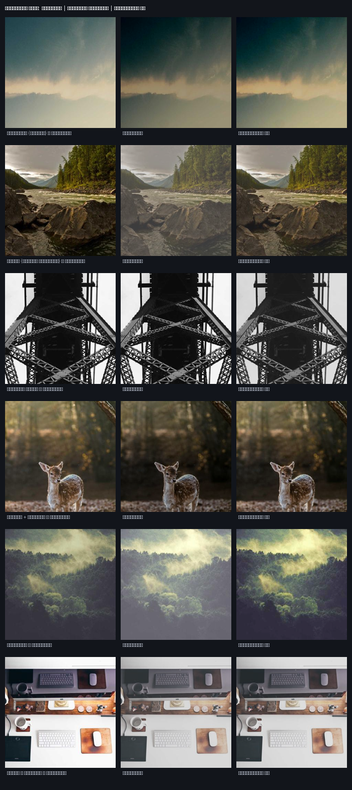
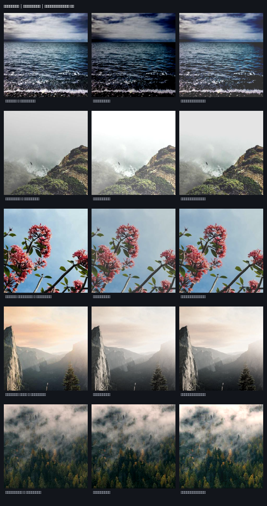

# Оценка качества работы системы

Документ закрывает этапы **3 (эталонный пул)** и **6 (оценка качества)** из плана ТЗ.

## Как вообще понять, что фото стало «лучше»?

«Лучше» бывает объективным и субъективным, поэтому используются три независимых
подхода — чтобы вывод не держался на чьём-то «мне кажется»:

1. **С эталоном (degrade-restore).** Берём хорошее фото → намеренно портим →
   смотрим, насколько система вернула его к **оригиналу** (метрики PSNR/SSIM).
   Это честное «ближе к хорошему», измеримо.
2. **Без эталона (no-reference).** Меряем свойства самой картинки, которые
   связаны с качеством: экспозиция, контраст, цветность. Показываем, что система
   двигает их в правильную сторону на реальных фото.
3. **Глазами.** Визуальный монтаж до/после на настоящих фотографиях.

## Методика (подход 1)

1. **Эталонный пул — 80 фотографий**, которых модель **не видела при обучении**.
2. Каждое фото портим по 5 категориям (тёмное, пересвет, низкий контраст, блёклый
   цвет, смешанное) — **400 тестовых случаев**.
3. Сравниваем результат с оригиналом по **PSNR** (дБ) и **SSIM** (0…1).
4. Отдельно — тест **«не навреди»** на неискажённых хороших фото.
5. Стратегии: **без коррекции** / **ИИ-модель** / **классическая база**.

> Математика коррекции идентична браузерному шейдеру (`src/enhance/webgl.ts`), а
> модель — та же, что в `public/model/`. Скрипт: [`training/eval.py`](../training/eval.py).

## Результаты — PSNR (дБ)

| Категория | Без коррекции | **ИИ-модель** | Классич. база | Прирост ИИ |
|---|---:|---:|---:|---:|
| Тёмное | 14.05 | **22.88** | 18.80 | +8.83 |
| Пересвет | 14.31 | **24.06** | 18.20 | +9.74 |
| Низкий контраст | 20.65 | **24.38** | 20.83 | +3.73 |
| Блёклый цвет | 39.03 | 25.59 | 21.99 | −13.44 |
| Смешанное | 20.57 | **25.88** | 20.73 | +5.32 |
| **ИТОГО** | 21.72 | **24.56** | 20.11 | **+2.84** |

## Результаты — SSIM (0…1)

| Категория | Без коррекции | **ИИ-модель** | Классич. база |
|---|---:|---:|---:|
| Тёмное | 0.642 | **0.898** | 0.850 |
| Пересвет | 0.846 | **0.943** | 0.862 |
| Низкий контраст | 0.900 | **0.952** | 0.921 |
| Блёклый цвет | 0.988 | **0.957** | 0.927 |
| Смешанное | 0.907 | **0.951** | 0.908 |
| **ИТОГО** | 0.857 | **0.940** | 0.893 |

**Доля случаев, где ИИ улучшил изображение: 74%.** Модель **превосходит
классическую базу во всех 5 категориях** по обеим метрикам.

## Тест «не навреди» (неискажённые хорошие фото)

Чем выше PSNR/SSIM и меньше «сила правки», тем бережнее система к хорошим фото.

| Стратегия | PSNR, дБ | SSIM | Сила правки |
|---|---:|---:|---:|
| **ИИ-модель** | **28.45** | **0.965** | **0.180** |
| Классич. база | 21.62 | 0.924 | 0.720 |

Модель почти не трогает уже хорошие фото (сила правки в **4×** меньше, чем у
классического алгоритма) — то есть понимает, когда улучшать нечего.

## Демонстрация на реальных фото + метрики без эталона (подходы 2 и 3)

На настоящих фотографиях создаём типичные проблемы и прогоняем через систему.
Метрики **без эталона** двигаются в сторону «здоровой» картинки:

| Проблема | PSNR проблема→ориг | PSNR после→ориг | Экспозиция | Цветность |
|---|---:|---:|---|---|
| Недосвет (тёмное) | 13.20 | **16.33** | 0.33 → 0.41 | 27 → 38 |
| Дымка (низкий контраст) | 16.03 | **24.23** | контраст 0.13 → 0.17 | 15 → 25 |
| Тёмное + блёклое | 18.15 | **22.44** | 0.20 → 0.25 | 16 → 21 |
| Пересвет | 13.98 | **24.30** | 0.57 → 0.40 | 21 → 34 |

(экспозиция — средняя яркость, хорошо ~0.45–0.55; цветность — colorfulness по
Hasler–Süsstrunk). Видно, что после обработки картинка **и ближе к хорошему
оригиналу, и лучше по независимым метрикам**.

Визуальное сравнение «Оригинал | Проблема | Исправлено ИИ» на настоящих фото:



Синтетические категории (degrade-restore), все 5 типов искажений:



Скрипты: [`eval.py`](../training/eval.py) (метрики), [`demo_real.py`](../training/demo_real.py)
(реальные фото). Числа: [`eval/metrics.json`](eval/metrics.json).

## Вывод

По всем трём независимым подходам система **измеримо улучшает изображения**:
ИИ-модель превосходит классический алгоритм во всех категориях, восстанавливает
испорченные фото ближе к оригиналу (+2.84 дБ PSNR, SSIM 0.94) и при этом бережно
относится к уже хорошим кадрам. Вместе с [бенчмарком](BENCHMARK.md) (скорость,
память, CPU) и размером 3.65 МБ решение закрывает все пять критериев оценки.

## Воспроизведение

```bash
cd training
.venv/Scripts/python eval.py        # метрики + монтаж синтетики
.venv/Scripts/python demo_real.py   # реальные фото + no-reference метрики
```
