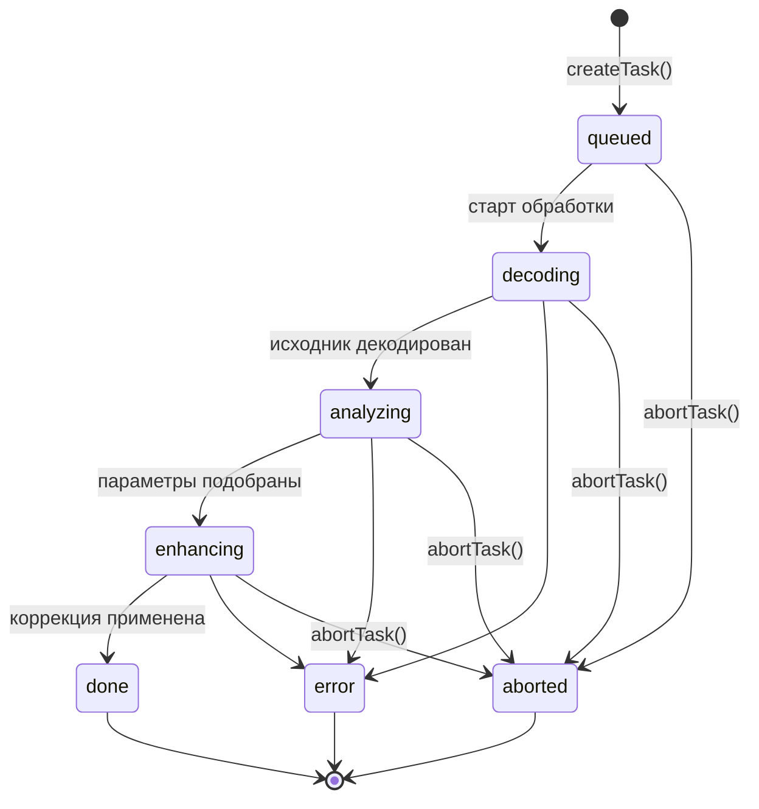
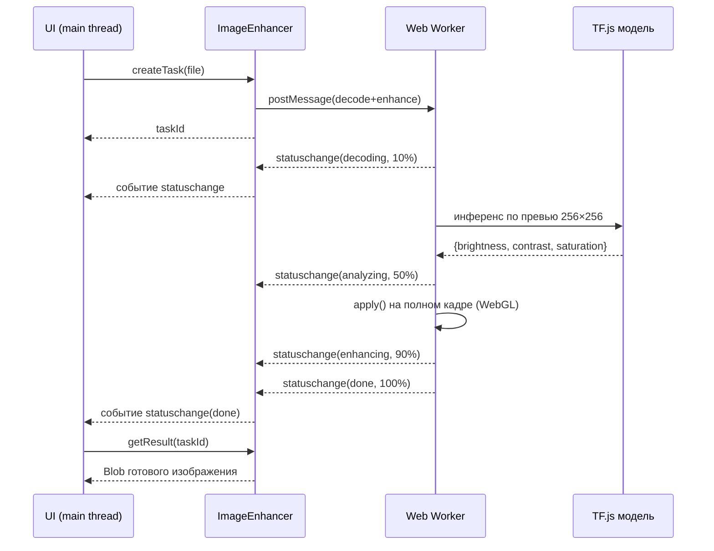
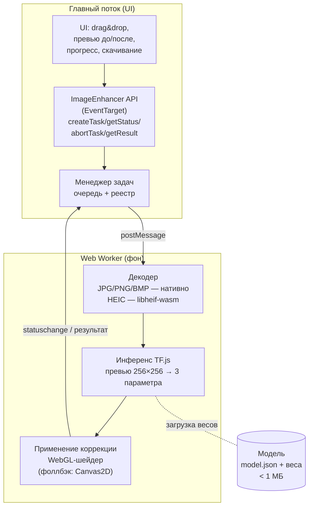

# Техническое задание

## Система улучшения изображений в реальном времени средствами ML в браузере

**Рабочее название:** BrowserImageEnhancer
**Версия документа:** 1.0
**Дата:** 2026-06-29
**Статус:** утверждается

---

## 1. Общие сведения

### 1.1. Назначение системы
Клиентская (браузерная) система автоматического улучшения изображений с помощью
ML-модели, выполняемой **целиком на устройстве пользователя**. Изображения
не передаются на сервер — обработка полностью локальна, что обеспечивает
приватность и работу без сетевой задержки.

### 1.2. Цель
ИИ автоматически подбирает оптимальные параметры коррекции по трём осям —
**яркость, контрастность, цветность (насыщенность)**, а вспомогательный
алгоритм применяет эти параметры к изображению в полном разрешении.

### 1.3. Принцип «модель подбирает — алгоритм применяет»
Это ключевое архитектурное решение. Вместо тяжёлой image-to-image нейросети
(десятки МБ весов, секунды на мегапиксель) используется **лёгкая
CNN-регрессия**, которая по уменьшенной копии изображения (превью 256×256)
предсказывает 3 числовых параметра. Применение параметров к полному
изображению выполняет быстрый детерминированный алгоритм (GPU-шейдер).

**Следствия:**
- размер модели < 1 МБ → укладываемся в лимит 10 МБ;
- инференс по превью — единицы миллисекунд;
- применение к 15 Мпк — доли секунды на WebGL;
- результат предсказуем и воспроизводим.

---

## 2. Термины и определения

| Термин | Определение |
|--------|-------------|
| **Задача (Task)** | Единица обработки одного изображения с уникальным идентификатором |
| **Параметры коррекции** | Тройка значений `{brightness, contrast, saturation}` |
| **Превью** | Уменьшенная до 256×256 копия изображения, вход модели |
| **Инференс** | Прогон превью через ML-модель для получения параметров |
| **Применение (apply)** | Попиксельное преобразование полного изображения по параметрам |
| **Бэкенд TF.js** | Вычислительный движок: WebGPU → WebGL → WASM (по доступности) |
| **Эталонный пул** | Набор изображений для оценки качества и производительности |

---

## 3. Функциональные требования

| ID | Требование |
|----|-----------|
| FR-1 | Приём исходного изображения через API (`File`, `Blob`, `ArrayBuffer`, `ImageBitmap`) |
| FR-2 | Постановка задачи в очередь обработки, возврат идентификатора задачи |
| FR-3 | Декодирование форматов JPG, PNG, BMP (нативно) и HEIC (через WASM) |
| FR-4 | Автоматический подбор параметров коррекции ML-моделью |
| FR-5 | Применение коррекции к изображению в полном разрешении |
| FR-6 | Информирование о ходе обработки: статус + прогресс (0–100 %) |
| FR-7 | Генерация события при изменении статуса/прогресса задачи |
| FR-8 | Опрос статуса задачи по идентификатору (pull-механизм) |
| FR-9 | Прерывание задачи по идентификатору |
| FR-10 | Выгрузка готового изображения (`Blob` / `ImageBitmap` / `DataURL`) |
| FR-11 | Пользовательский интерфейс: загрузка (drag&drop), превью «до/после», прогресс, скачивание |

---

## 4. Нефункциональные требования

Требования из условия задачи и способ их выполнения:

| Требование | Целевое значение | Решение | Критерий приёмки |
|-----------|------------------|---------|------------------|
| **Совместимость** | Все массовые современные браузеры | Цепочка бэкендов WebGPU→WebGL→WASM; фоллбэки для OffscreenCanvas/HEIC | Работает в Chrome, Firefox, Safari, Edge (последние 2 версии) |
| **Объём кода** | ≤ 10 МБ | Лёгкая модель + квантизация + ленивая загрузка WASM (HEIC грузится только при необходимости) | Итоговый бандл (gzip) измеряется, отчёт в README |
| **Разрешение** | до 15 Мпк | GPU-обработка; при нехватке памяти — тайлинг | Эталон 15 Мпк обрабатывается корректно |
| **Макс. время** | ≤ 30 с | GPU-шейдер + Worker | p100 на 15 Мпк ≤ 30 с |
| **Среднее время** | ≤ 5 с | Инференс по превью, не по полному кадру | p50 ≤ 5 с на эталонном пуле |
| **Форматы** | JPG, PNG, HEIC, BMP | Нативный декод + libheif-wasm | Все 4 формата проходят пайплайн |
| **Асинхронность** | Без блокировки UI | Web Worker + OffscreenCanvas; main-thread только обмен сообщениями | Нет long-task > 50 мс на main thread, UI отзывчив |

---

## 5. Спецификация API

API спроектирован согласно рекомендованной в задании структуре: 4 метода + 1 событие.
Объект `ImageEnhancer` наследует `EventTarget`.

### 5.1. Типы

```ts
type TaskStatus =
  | 'queued'      // поставлена в очередь
  | 'decoding'    // декодирование исходника
  | 'analyzing'   // инференс модели (подбор параметров)
  | 'enhancing'   // применение коррекции
  | 'done'        // готово
  | 'aborted'     // прервана пользователем
  | 'error';      // ошибка

interface TaskProgress {
  taskId: string;
  status: TaskStatus;
  progress: number;        // 0..100
  message?: string;        // человекочитаемое описание этапа
  params?: EnhanceParams;  // подобранные параметры (с этапа analyzing)
  error?: string;          // текст ошибки (для status === 'error')
}

interface EnhanceParams {
  brightness: number;  // сдвиг яркости,        диапазон ~[-0.5 .. +0.5]
  contrast: number;    // множитель контраста,  диапазон ~[0.5 .. 2.0]
  saturation: number;  // множитель насыщенности, диапазон ~[0.0 .. 2.0]
}

interface CreateTaskOptions {
  autoStart?: boolean;          // по умолчанию true
  maxDimension?: number;        // ограничение стороны для защиты от OOM
  outputType?: 'image/jpeg' | 'image/png';
  quality?: number;             // 0..1 для JPEG
}
```

### 5.2. Методы

```ts
// 1. Постановка задачи — возвращает идентификатор задачи
createTask(input: File | Blob | ArrayBuffer | ImageBitmap,
           options?: CreateTaskOptions): Promise<string>;

// 2. Получение статуса — текущий статус и прогресс
getStatus(taskId: string): TaskProgress;

// 3. Прерывание задачи — информация об успешном выполнении
abortTask(taskId: string): Promise<{ success: boolean }>;

// 4. Получение готового изображения
getResult(taskId: string,
          as?: 'blob' | 'bitmap' | 'dataurl'): Promise<Blob | ImageBitmap | string>;
```

### 5.3. События

```ts
// Событие изменения статуса задачи.
// Возникает при ЛЮБОМ изменении статуса или значения прогресса.
enhancer.addEventListener('statuschange', (e: CustomEvent<TaskProgress>) => {
  const { taskId, status, progress } = e.detail;
});
```

### 5.4. Пример использования

```ts
const enhancer = new ImageEnhancer();

enhancer.addEventListener('statuschange', (e) => {
  const { status, progress } = e.detail;
  progressBar.value = progress;
  label.textContent = status;
});

const id = await enhancer.createTask(file);   // постановка
// ... статусы приходят событиями ...
const blob = await enhancer.getResult(id, 'blob');  // выгрузка
download(blob);
```

### 5.5. Диаграмма состояний задачи



### 5.6. Последовательность взаимодействия



---

## 6. Архитектура системы



**Поток данных:** исходник → декодирование в `ImageData`/текстуру → даунскейл
до превью → инференс (3 параметра) → применение параметров к полному кадру →
кодирование в выходной формат → выдача `Blob`.

**Почему Web Worker:** весь тяжёлый код (декод HEIC, инференс, попиксельная
обработка) выполняется вне главного потока. Главный поток лишь отправляет
сообщения и ретранслирует события — UI остаётся отзывчивым (требование
асинхронности).

---

## 7. ML-модель

### 7.1. Постановка задачи обучения
Регрессия: вход — изображение (превью), выход — 3 числа (параметры коррекции,
приводящие изображение к «хорошему» виду).

### 7.2. Архитектура сети (компактная CNN, MobileNet-подобная)

| Слой | Параметры | Выход |
|------|-----------|-------|
| Вход | RGB, нормировка [0,1] | 256×256×3 |
| Conv + BN + ReLU | 3×3, stride 2, 16 | 128×128×16 |
| Depthwise-Separable ×2 | stride 2, 32 | 64×64×32 |
| Depthwise-Separable ×2 | stride 2, 64 | 32×32×64 |
| Depthwise-Separable ×2 | stride 2, 128 | 16×16×128 |
| GlobalAveragePooling | — | 128 |
| Dense + ReLU | 64 | 64 |
| Dense (выход) | 3 | 3 параметра |

Целевой размер после квантизации (float16/uint8): **< 500 КБ**.

### 7.3. Данные для обучения (self-supervised)
Пул качественных, хорошо сбалансированных фотографий (например, подмножество
**MIT-Adobe FiveK**, **DIV2K**, открытые фото Unsplash). Метод:
1. Берём «хорошее» изображение `I`.
2. Случайно портим яркость/контраст/насыщенность параметрами `p` →
   получаем «плохое» изображение `I'`.
3. Целевая метка — параметры, восстанавливающие `I` из `I'`.
4. Сеть учится по `I'` предсказывать корректирующие параметры.

### 7.4. Функция потерь
- `L_param` = MSE между предсказанными и истинными параметрами;
- `L_recon` = MSE/SSIM между восстановленным `apply(I', p̂)` и `I` (опционально,
  для перцептивной согласованности);
- `L = L_param + λ · L_recon`.

### 7.5. Обучение и экспорт
- Обучение: Python, TensorFlow/Keras (Python 3.12 уже установлен).
- Аугментации, разделение train/val.
- Экспорт: `tensorflowjs_converter` → `model.json` + шарды весов с квантизацией.
- **Базовая линия (fallback):** классический авто-алгоритм (auto-levels /
  gray-world / выравнивание гистограммы) — работает без модели и служит точкой
  сравнения качества.

---

## 8. Алгоритм применения коррекции

Параметры применяются к каждому пикселю (значения в `[0,1]`). Реализация —
фрагментный шейдер WebGL; CPU-фоллбэк — та же математика над `Uint8ClampedArray`.

```glsl
// 1. Яркость (аддитивный сдвиг)
c = c + brightness;

// 2. Контраст (относительно средней точки 0.5)
c = (c - 0.5) * contrast + 0.5;

// 3. Насыщенность (интерполяция к яркостной компоненте)
float Y = dot(c, vec3(0.299, 0.587, 0.114));   // luma
c = mix(vec3(Y), c, saturation);

// 4. Ограничение диапазона
c = clamp(c, 0.0, 1.0);
```

Порядок операций фиксирован: яркость → контраст → насыщенность → clamp.

---

## 9. Поддержка форматов

| Формат | Декодирование | Примечание |
|--------|---------------|-----------|
| **JPG** | `createImageBitmap` (нативно) | Быстро, без зависимостей |
| **PNG** | `createImageBitmap` (нативно) | Поддержка альфа-канала |
| **BMP** | `createImageBitmap` (нативно) | Поддерживается современными браузерами |
| **HEIC** | **libheif-wasm** | Не поддерживается нативно в большинстве браузеров; WASM грузится лениво (только при загрузке HEIC), чтобы не раздувать стартовый бандл |

Выходной формат: JPEG (по умолчанию) или PNG — задаётся в `CreateTaskOptions`.

---

## 10. Производительность и оптимизация

- **Инференс по превью**, а не по полному кадру — главный источник скорости.
- **GPU-применение** через WebGL — 15 Мпк за один проход.
- **Тайлинг** для очень больших изображений при ограничении памяти GPU.
- **Ленивая загрузка** libheif-wasm и бэкенда WASM.
- **Квантизация** весов модели.
- **Переиспользование** WebGL-контекста и текстурных буферов между задачами.
- **Backpressure**: очередь задач ограничивает число одновременных обработок.

Метрики для отчёта (критерии выбора лучших работ): качество результата,
скорость, потребление ОЗУ, загрузка CPU/GPU, итоговый размер решения.

---

## 11. Эталонный пул изображений и метрики качества

### 11.1. Состав пула (этап 3 алгоритма проекта)
20–30 изображений, покрывающих ключевые кейсы:
- недо-/переэкспонированные;
- низкоконтрастные;
- блёклые (низкая насыщенность);
- корректно сбалансированные (контроль «не испортить хорошее»);
- по одному образцу каждого формата (JPG, PNG, HEIC, BMP);
- образец **15 Мпк** для теста производительности.

### 11.2. Метрики

| Категория | Метрика | Цель |
|-----------|---------|------|
| Качество (с эталоном) | PSNR, SSIM, ΔE | выше базовой линии |
| Качество (без эталона) | BRISQUE / NIQE | не хуже исходника |
| Скорость | время обработки, p50 / p95 / max | ≤ 5 / — / ≤ 30 с |
| Память | пиковое потребление | без OOM на 15 Мпк |
| Отзывчивость | long-tasks на main thread | отсутствуют |
| Размер | итоговый бандл (gzip) | ≤ 10 МБ |

---

## 12. Тестирование и приёмка

1. **Модульные тесты:** математика коррекции, конечный автомат задач, парсинг форматов.
2. **Интеграционные:** полный пайплайн на каждом формате.
3. **Производительность:** прогон эталонного пула, замер времени/памяти.
4. **Совместимость:** ручной прогон в Chrome, Firefox, Safari, Edge.
5. **Качество:** расчёт метрик на эталонном пуле, сравнение с базовой линией.
6. **Приёмка:** все NFR из раздела 4 выполнены; решение работает на всех эталонах.

---

## 13. Технологический стек

| Слой | Технология |
|------|-----------|
| Сборка | Vite + TypeScript |
| ML-рантайм | TensorFlow.js (`@tensorflow/tfjs`, бэкенды webgpu/webgl/wasm) |
| Декод HEIC | libheif-js (WASM) |
| Параллелизм | Web Workers + OffscreenCanvas |
| Применение коррекции | WebGL (фрагментный шейдер) + Canvas2D-фоллбэк |
| Обучение модели | Python 3.12, TensorFlow/Keras, `tensorflowjs` (конвертер) |
| Хостинг | Статический (GitHub Pages / Netlify / Vercel) |

---

## 14. Структура проекта

```
ProjectVK/
├── docs/                    # ТЗ, архитектура, отчёты
│   └── TECHNICAL_SPEC.md
├── src/
│   ├── api/                 # ImageEnhancer, менеджер задач
│   ├── worker/              # Web Worker: декод, инференс, apply
│   ├── ml/                  # загрузка и запуск модели
│   ├── enhance/             # WebGL-шейдеры, Canvas-фоллбэк
│   ├── decode/              # декодеры форматов (HEIC)
│   └── ui/                  # компоненты интерфейса
├── public/
│   ├── model/               # model.json + веса
│   └── wasm/                # tfjs-wasm, libheif
├── training/                # Python: подготовка данных, train.py, конвертация
├── reference/               # эталонный пул изображений
├── index.html
├── vite.config.ts
├── tsconfig.json
└── package.json
```

---

## 15. Этапы работ

Согласно алгоритму выполнения проекта:

| № | Этап | Статус |
|---|------|--------|
| 1 | Уточнение требований | ✅ выполнено |
| 2 | Формирование ТЗ | ✅ настоящий документ |
| 3 | Формирование эталонного пула изображений | ⏭️ следующий |
| 4 | Реализация базовой функциональности (каркас, API, пайплайн с базовой линией) | ⏳ |
| 5 | Отладка на основных кейсах ТЗ | ⏳ |
| 6 | Обучение модели и оценка качества на эталонах | ⏳ |
| 7 | Сдача проекта (деплой, ссылка на публичный хостинг) | ⏳ |

---

## 16. Риски и митигации

| Риск | Митигация |
|------|-----------|
| HEIC раздувает бандл | Ленивая загрузка libheif-wasm только при необходимости |
| Нехватка GPU-памяти на 15 Мпк | Тайлинг изображения при обработке |
| WebGPU доступен не везде | Цепочка фоллбэков WebGPU→WebGL→WASM |
| Низкое качество модели на синтетике | Добавить реальные пары из FiveK; дообучение |
| OffscreenCanvas не поддержан (старый Safari) | Фоллбэк на обработку в главном потоке через RAF-чанки |
| Превышение лимита 10 МБ | Квантизация модели, аудит зависимостей, gzip-отчёт |

---

*Документ является основанием для этапов 3–7. Изменения фиксируются повышением версии.*
